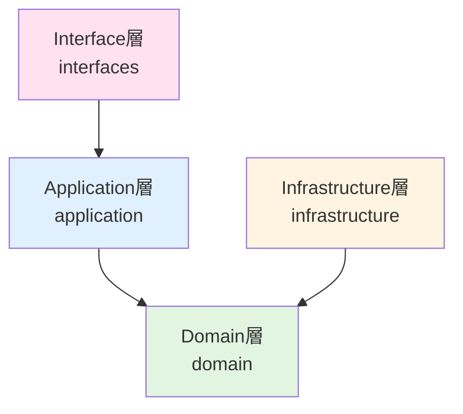

# PACKAGE_DESIGN.md

このドキュメントは、このプロジェクトのパッケージ構成とアーキテクチャ設計について説明します。

## プロジェクト構造

### ディレクトリ構成

```text
src/
├── interfaces/         # インターフェース層
│   └── handlers/       # MCPツールハンドラー
├── application/         # アプリケーション層
│   └── workflows/     # ワークフロー（ユースケース）
├── domain/              # ドメイン層（ビジネスロジック）
│   ├── models/
│   │   ├── entities/   # エンティティ
│   │   └── value-objects/  # 値オブジェクト
│   └── repositories/    # リポジトリインターフェース
├── infrastructure/      # インフラストラクチャ層
│   ├── repositories/   # リポジトリ実装（Domain層のインターフェースを実装）
│   ├── clients/        # 外部サービスクライアント（データベース、外部API、ファイルシステムなど）
│   └── mapper/         # データマッパー（DBレコードとドメインモデルの変換）
├── core/                # コア層（共通機能）
│   ├── config/         # 設定
│   ├── errors/         # エラー定義
│   ├── models/         # 共通モデル（JsonRpcCodeなど）
│   └── utils/          # ユーティリティ（IdGenerator、ResponseBuilder、ResultUtilsなど）
└── index.ts
```

## アーキテクチャ原則

### 依存関係の方向



- **Domain層**: 他の層に依存しない純粋なビジネスロジック
- **Application層**: Domain層に依存し、ユースケースを実装
- **Infrastructure層**: Domain層のインターフェースを実装
- **Interface層**: Application層を呼び出し、HTTPリクエスト/レスポンスを処理

### レイヤーの責務

#### Domain層 (`src/domain/`)

- **エンティティ**: ビジネスルールを持つオブジェクト（型エイリアスで定義）
- **値オブジェクト**: 不変の値オブジェクト（`zod` スキーマを使用してバリデーション）
- **リポジトリインターフェース**: データアクセスの抽象化（`ResultAsync` 型を返す）
- **ドメインサービス**: エンティティに属さないビジネスロジック（`Result` 型を返し、メソッドチェーンを使用）

**重要**: Domain層の値オブジェクトは `Result<T, E>` 型を返し、エラーハンドリングは `neverthrow` のメソッドチェーンを使用します。

#### Application層 (`src/application/`)

- **ワークフロー**: ユースケースの実装（`ResultAsync` 型を返し、メソッドチェーンを使用）

**重要**: Application層のワークフローは必ず `ResultAsync<T, E>` 型を返し、複数の処理を `neverthrow` のメソッドチェーンで連結します。

#### Infrastructure層 (`src/infrastructure/`)

- **repositories**: Domain層のリポジトリインターフェースの実装
- **clients**: 外部サービスクライアント（データベース、外部API、ファイルシステムなど）

#### Interface層 (`src/interfaces/`)

- MCPツールの処理（HTTPリクエスト/レスポンスの処理）
- ルーティング
- バリデーション（Zod）
- Application層から返された `Result` や `ResultAsync` を `match()` などで処理

#### Core層 (`src/core/`)

- **config**: アプリケーション設定
- **errors**: 共通エラー定義

**注意**: Core層は他のすべての層から使用可能な共通機能を提供します。ただし、Domain層のビジネスロジックには依存しません。
